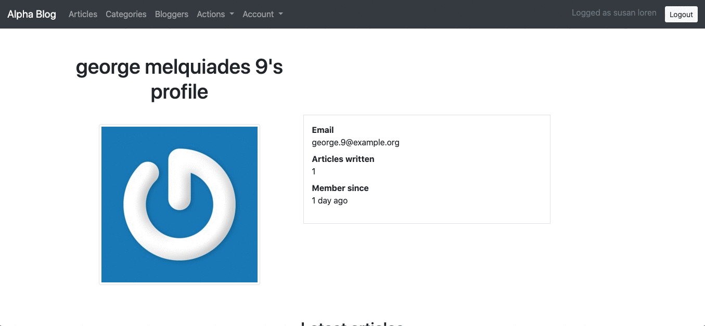

# Alpha Blog

[live version](https://srodrig-alpha-blog.herokuapp.com/)

A blog built with Ruby on Rails 6, among its features are included
sessions management, articles, and categories. It is fully tested, you may
use it with confidence.



## Requirements

- [node](https://nodejs.org/en/)
- [yarn](https://yarnpkg.com/getting-started/install)
- [bundler](https://github.com/rubygems/rubygems/tree/master/bundler) ~> 2.1.4

## Setup

First and foremost, clone this repository (and give it a star).

```sh
git clone https://github.com/santiago-rodrig/alpha-blog.git && cd alpha-blog
```

Install the dependencies for the project.

```sh
bundle config set without 'production' && \
bundle install && yarn install --check-files
```

Run the database migrations.

```sh
rails db:migrate
```

Optionally, run the tests to make sure everything is OK.

```sh
rails test
```

Optionally (again), you may populate your development database with
dummy data and see how it will look like when users start to login and
create articles.

```sh
rais db:seed
```

## License

This project is MIT licensed, you can [read the license here](./LICENSE).

## Contact

You can reach out to me through the following URLs.

- [My website](https://santiagorodriguez.dev)
- [Github](https://github.com/santiago-rodrig)
- [LinkedIn](https://www.linkedin.com/in/santiago-andres-rodriguez-marquez/)
- [AngelList](https://angel.co/u/santiago-andres-rodriguez-marquez)
- [santo1996.29@gmail.com](mailto:santo1996.29@gmail.com)

